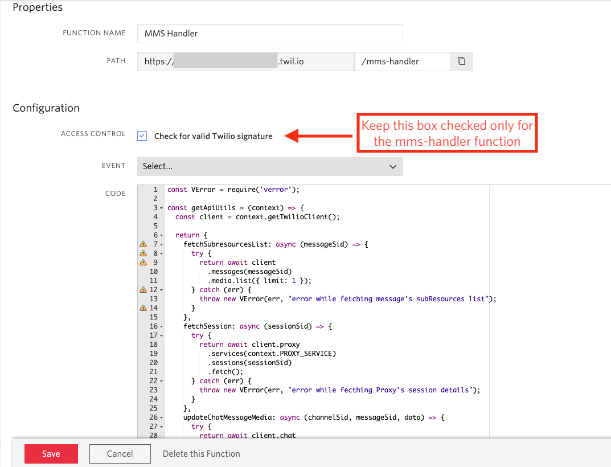
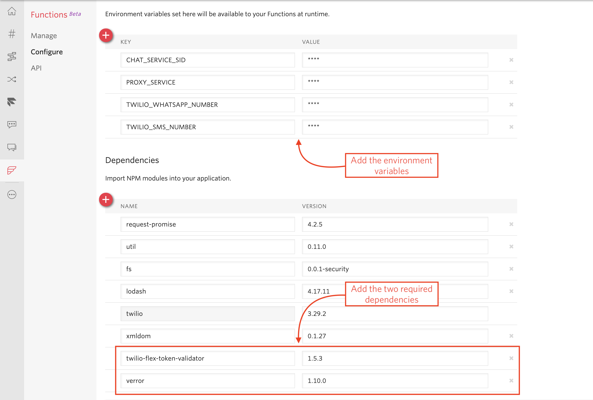
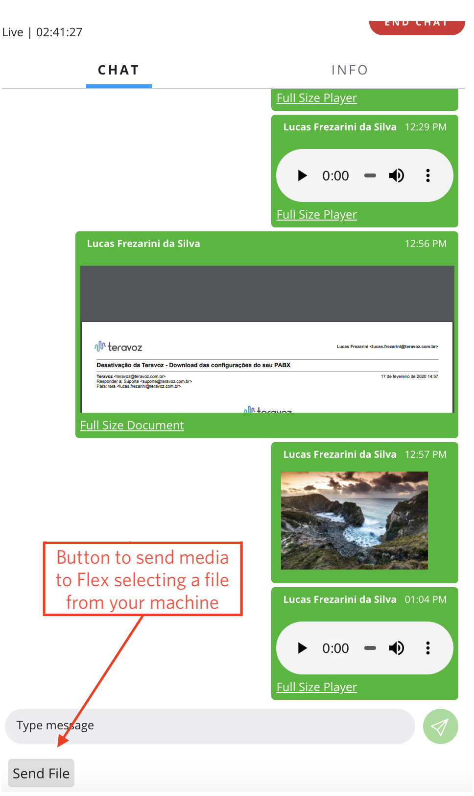

<a  href="https://www.twilio.com">

</a>

> **Note:** Detailed documentation is also available in Brazilian Portuguese. To read the instructions in that language, navigate to the `docs/pt-br` subfolder.

# WhatsApp MMS for Flex WebChat

The WhatsApp MMS for Flex Webchat plugin allows you to send a media message over WhatsApp and render it within a Flex chat window. Upon sending the message, any qualified agent will see an incoming chat request from a WhatsApp number following the `whatsapp:<E.164-formatted phone number>` format.

## Setup

### Requirements

To deploy this plugin, you will need:
- An active Twilio account with Flex provisioned. Refer to the [Flex Quickstart](https://www.twilio.com/docs/flex/quickstart/flex-basics#sign-up-for-or-sign-in-to-twilio-and-create-a-new-flex-project) to create one.
- npm version 5.0.0 or 6 installed (type `npm -v` in your terminal to check)
- Node version 10.12.0 or later installed (type `node -v` in your terminal to check)
- A mobile device with WhatsApp installed
- [Twilio CLI](https://www.twilio.com/docs/twilio-cli/quickstart#install-twilio-cli) along with the [Flex CLI Plugin](https://www.twilio.com/docs/twilio-cli/plugins#available-plugins) and the [Serverless Plugin](https://www.twilio.com/docs/twilio-cli/plugins#available-plugins). * Run the following commands to install them:
   ```
   # Install the Twilio CLI
   npm install twilio-cli -g
   # Install the Serverless and Flex as Plugins
   twilio plugins:install @twilio-labs/plugin-serverless
   twilio plugins:install @twilio-labs/plugin-flex@beta
   ```
   
   * The Twilio CLI with the Serverless and Flex Plugins are recommended for local development and debugging purposes, but you have the option to use the Functions UI in the Twilio Console.


### Twilio Account Settings

Before we begin, we need to collect
all the config values we need to run the plugin on your Flex application:

| Config&nbsp;Value | Description                                                                                                                                                  |
| :---------------- | :----------------------------------------------------------------------------------------------------------------------------------------------------------- |
| Account&nbsp;Sid  | Your primary Twilio account identifier - find this [on the Console Dashboard](https://www.twilio.com/console).                                                         |
| Auth Token  | Your Twilio Auth Token, which acts as your password - find this [on the Console Dashboard](https://www.twilio.com/console).                                                         |
| Chat Service SID | Unique identifier for your Flex Chat Service. You can find this on the [Programmable Chat Dashboard](https://www.twilio.com/console/chat/dashboard).                                    |
| Twilio WhatsApp Number | The WhatsApp number to use when sending messages to a WhatsApp recipient. You can find this either on the [Twilio Sandbox for WhatsApp page](https://www.twilio.com/console/sms/whatsapp/learn) if you're using a test number, or the [WhatsApp Senders](https://www.twilio.com/console/sms/whatsapp/senders) if you've enabled personalized WhatsApp numbers.                                  |
| Twilio SMS Number | A Twilio phone number with MMS capability. You can check your numbers in the [Phone Numbers Dashboard](https://www.twilio.com/console/phone-numbers/incoming). |

## Plugin Details

Twilio Proxy does not support media messages natively, so it is necessary to monitor Proxy messages to detect media messages and then update the Flex Chat Channel message attributes with the media URL and media type. To facilitate sending MMS via WhatsApp and rendering the media on the Flex Chat UI, we have added the following Twilio Functions:

1) **mms-handler.protected.js**: This Twilio Function will be called every time a Proxy interaction occurs. It uses the Proxy Callback URI to check for the existence of an MMS in an incoming message.

2) **send-media-message.js**: This Twilio Function is called by the Flex plugin to send the media to the recipient using the Programmable Messaging API. Since Proxy does not currently support media messages, we have to bypass it and call the Programmable Messaging API directly.

## Local Development

After the above requirements have been met:

1. Clone this repository: `git clone https://github.com/twilio-labs/plugin-message-media.git`
1. Set your Functions [environment variables](#twilio-account-settings), install your package dependencies, and deploy your Twilio Functions.
1. Set your plugin environment variable with the value of your Twilio Functions domain.   
1. Copy `public/appConfig.example.js` to `public/appConfig.js`.
1. Install plugin dependencies: `npm install`

To test the plugin locally, run the following command:

  ```bash
npm run start
```
Alternatively, you can use this command to start the server in development mode. It will reload whenever you change any files.

```bash
npm run dev
```

> **Note:** We recommend you install the Twilio Flex Plugins CLI. To [start your plugin locally](https://www.twilio.com/docs/flex/quickstart/getting-started-plugin), you can run `twilio flex:plugins:start`.

Navigate to [http://localhost:3000](http://localhost:3000).

That's it!

## Functions Deployment

You can upload these functions to your Twilio account in two ways: deploying via the Twilio CLI or copying and pasting the Functions code into the [Functions UI](https://www.twilio.com/console/functions/manage) within the Console. Make sure to set the environment variables and package dependencies regardless of which method you use.

### Serverless Toolkit

#### Install the Twilio CLI and Serverless Plugins

For installation instructions, see the [Requirements](#requirements) list.

**Configure your Flex Workspace**

In order to use this plugin, you need to prepare your **Flex Task Assignment** workspace.

**Retrieve your Flex settings**

Navigate to your Flex project in the [Twilio Console](https://www.twilio.com/console).  Copy your **ACCOUNT SID** and **AUTH TOKEN**, and create a new Twilio CLI profile using those credentials and activate it.

```
twilio profiles:create
You can find your Account SID and Auth Token at https://www.twilio.com/console
 » Your Auth Token will be used once to create an API Key for future CLI access to your Twilio Account or Subaccount, and then forgotten.
? The Account SID for your Twilio Account or Subaccount: ACxxx
? Your Twilio Auth Token for your Twilio Account or Subaccount: [hidden]

? Shorthand identifier for your profile: whatsappmmsforflex
Created API Key SKxxx and stored the secret in your keychain.
Saved whatsappmmsforflex.

twilio profiles:use whatsappmmsforflex
```

Keep in mind that this account will be used for the rest of the deployment. In order to switch accounts, use the command `twilio profiles:use <different_profile>`.

Retrieve your **Flex Task Assignment** workspace ID:
```
twilio api:taskrouter:v1:workspaces:list
```

**Example Workspace SID**

```
 SID                             Friendly Name               Prioritize Queue Order
WSxxxx                           Flex Task Assignment        FIFO    
```

Inside the folder `mms-handler` of this repository, copy the `.env.example` and create a `.env` file.  If you're running Windows, see the Windows Environment Variables section in [this blog post](https://www.twilio.com/blog/2017/01/how-to-set-environment-variables.html). For more details on the required values, see [Twilio Account Settings](twilio-account-settings).

```
ACCOUNT_SID=AC0000000000000000000000000000000000
AUTH_TOKEN=0000000000000000000000000000000000000
CHAT_SERVICE_SID=IS00000000000000000000000000000
PROXY_SERVICE=KS00000000000000000000000000000000
TWILIO_WHATSAPP_NUMBER=+14155238886
TWILIO_SMS_NUMBER=+19999999999
```

After providing all these data, you can deploy these functions to your account:

```zsh
$ twilio serverless:deploy

# Output: 

Deployment Details
Domain: your-domain-dev.twil.io
Service:
   mms-media (ZS0000000000000000000000000000)
Environment:
   dev (ZE0000000000000000000000000000) 
Build SID:
   ZB0000000000000000000000000000
View Live Logs:
   https://www.twilio.com/console/assets/api/ZS0000000000000000000000000000/environment/ZE0000000000000000000000000000
Functions:
   [protected] https://your-domain-dev.twil.io/mms-handler
   https://your-domain-dev.twil.io/send-media-message
Assets:
```

When the deployment finishes, copy and save the Functions' and the Domain's URLs. You will need it in the next step. 

If you forget to copy the domain, you can also find it by navigating to [Functions > API](https://www.twilio.com/console/functions/api) in the Twilio Console.

> Debugging Tip: Pass the -l or logging flag to review deployment logs. For example, you can pass `-l debug` to turn on debugging logs.

#### Functions UI Deployment

Copying the code of the Functions can be the fastest way to get started. In the [Functions Dashboard](https://www.twilio.com/console/functions/manage), you have to create two new functions: One named `MMS Handler` and another named `Send Media Message`. Define the path of these two functions as `/mms-handler` and `/send-media-message` respectively. Copy the code of each function that exists inside the directory `mms-handler/functions` and paste it into a Blank Function template in the UI.



Only the Function `mms-handler` should check for Twilio's Signature because it will be called directly by the Proxy service. The `send-media-message` Function needs to be called on the client-side by the Flex instance, so it will verify the Flex token that is passed on the request instead.

Save your changes to both functions. Copy and paste the full paths of both functions into a text file since you will need them later.

After you have added your Functions, go to the [Functions Configuration Page](https://www.twilio.com/console/functions/configure) and ensure "Enable ACCOUNT_SID and AUTH_TOKEN" is checked. In the section "Environment Variables", add the variables described in [Twilio Account Settings](twilio-account-settings).

Also add the following npm Function dependencies:

* twilio-flex-token-validator (1.5.3) -> Validates the Flex Token that will be sent in each request to the `Send Message Function` by the Flex UI.
* verror (1.10.0) -> Used in the `MMS handler` function to add more details to the errors if something goes wrong.



> When adding the `twilio-flex-token-validator` dependency, make sure to copy and paste it from a clipboard or a text file. There is a bug in the interface that blocks the input when typing 'twilio' in the field and you will be unable to complete the dependency name.

Save your changes. You are now ready to configure the Proxy Service and the Flex Plugin.

## Twilio Proxy Configuration

We now need to configure the Proxy Callback URL to point to that Function.

1. Navigate to the [Proxy Dashboard](https://www.twilio.com/console/proxy) and click on the Proxy Service used by your MMS and WhatsApp numbers.

1. In the Callback URL field, enter the `mms-handler` Function URL. If the deploy was made using the Serverless Toolkit, paste the `mms-handler` URL provided in the deploy command output. Otherwise, you can get that URL by navigating to the [Twilio Functions page](https://www.twilio.com/console/functions/manage), selecting the `MMS Handler` Function, and clicking the Copy button next to the Path.


1. Click **Save** at the bottom of the Proxy Configuration page after entering the Callback URL.

## Flex Plugin Deployment

The WhatsApp MMS for Flex WebChat plugin allows customers to render MMS sent over WhatsApp in the Flex WebChat and allows the agent to send media files to customers from their computer. You can see a demo below of this plugin:




From the plugin root directory, run the following commands:

1. Rename `public/appConfig.example.js` to `public/appConfig.js`.
1. Install the plugin dependencies.

```zsh
$ npm i
```

After that, create `.env.production` based on `.env.example`, and modify the `REACT_APP_SEND_MEDIA_ENDPOINT` property to the URL of the send-media-message.js function.

```javascript
REACT_APP_SEND_MEDIA_ENDPOINT=https://your-functions-domain/send-media-message.js
```

Check if you are logged in to the [Twilio CLI](https://github.com/twilio-labs/plugin-message-media#twilio-cli-setup)

At last, run the `twilio flex:plugins:deploy` command. For more details about this command, read the [Twilio Flex plugin CLI documentation](https://www.twilio.com/docs/flex/developer/plugins/cli). 

```zsh
twilio flex:plugins:deploy --major --changelog "Notes for this version" --description "Functionality of the plugin"
```

Upon successfully deploying your plugin, you should see a suggested next step for enabling it on your Flex application. After running the suggested next step, navigate to the [Plugins Dashboard](https://flex.twilio.com/admin/?_ga=2.33188926.1245483994.1613494659-1672783450.1612487462) to review your recently deployed plugin and confirm that it’s enabled for your contact center.

Now you can open your [Flex instance](https://flex.twilio.com/admin) and test if everything is working as expected!

## Contributing

Check out [CONTRIBUTING](CONTRIBUTING.md) for more information on how to contribute to this project.

## License

MIT © Twilio Inc.


## Credits

This plugin was based on the [mms2FlexChat plugin](https://github.com/jprix/mms2FlexChat). Many thanks to the original contributors:
* [jprix](https://github.com/jprix)
* [Terence Rogers](https://github.com/trogers-twilio)
* [Brad McAllister](https://github.com/bdm1981)

## License

[MIT](http://www.opensource.org/licenses/mit-license.html)

## Disclaimer

No warranty expressed or implied. Software is as is.

[twilio]: https://www.twilio.com
