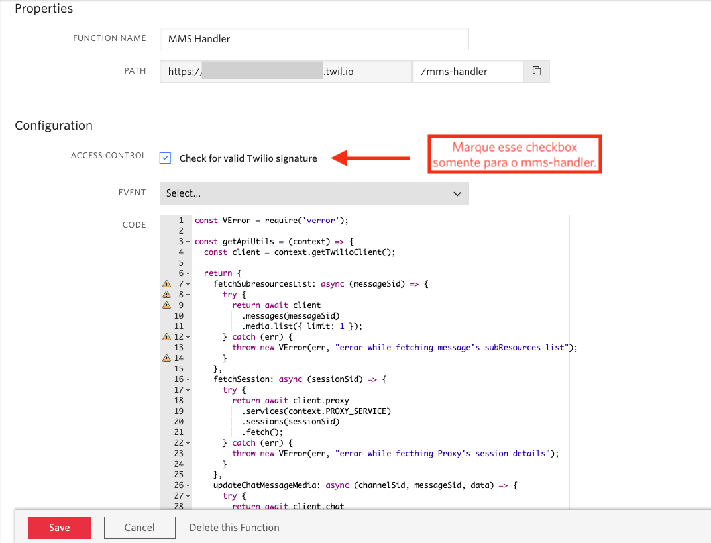
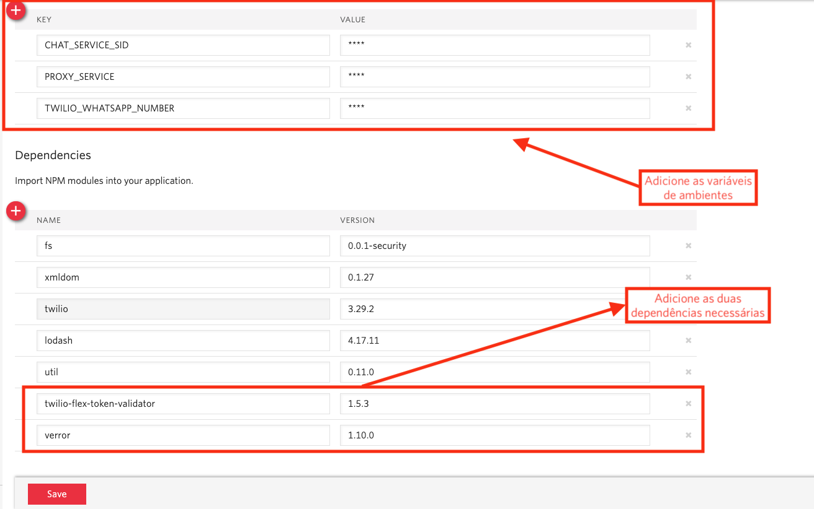
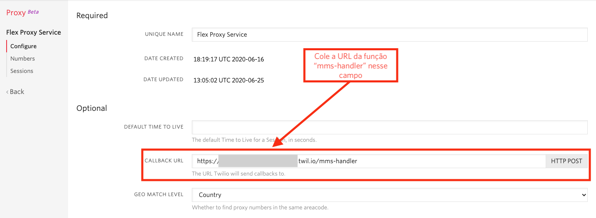

# mms2FlexChat

Permite que usuários envie media do MMS por SMS/Whatsapp e renderiza dentro da janela de chat do Flex.

Você precisa que o seu chat do Flex renderize media do MMS dentro do seu Flex UI?

# Quickstart

## Twilio Functions

Para permitir o envio de media MMS para o chat do flex, duas Twilio Functions são necessárias. Elas podem ser encontradas dentro da pasta `twilio-functions/functions` desse repositório. Abaixo, você pode ver uma breve descrição sobre o que cada uma delas faz:

1) mms-handler.protected.js: Essa Function vai ser chamada toda vez que ocorrer uma interação com o Twilio Proxy, usando o URI do Proxy Callback. Ela vai checar se um MMS existe na mensagem de SMS/Whatsapp recebida.

2) send-media-message.js: Essa Function vai ser chamada pelo plugin do Flex para enviar a midia para o cliente usando a API de mensagens da Twilio. O Proxy não suporta mensagens com midia, então temos que chamar a API de mensagens diretamente por essa função para fazer um caminho alternativo.

Você pode realizar o upload dessas funções em sua conta da Twilio por dos métodos: realizando o upload via o [Serverless Toolkit](https://www.twilio.com/docs/labs/serverless-toolkit) ou copiando e colando o código das funções na [interface de Functions](https://www.twilio.com/console/functions/manage) no Console da Twilio.

Em qualquer uma das opções que você escolher, as seguintes variáveis de ambiente devem ser definidas:

* **PROXY_SERVICE**
    * SID do Proxy Service em que as mensagens de MMS e de WhatsApp são direcionadas
    * Você pode encontrar essa informação no [Dashboard do Proxy](https://www.twilio.com/console/proxy). Por padrão, o Proxy usado pelo Flex tem o nome de "Flex Proxy Service".
* **CHAT_SERVICE_SID**
    * SID do serviço de Programmable Chat usado em seus Flows do Flex
    * Você pode encontrar essa informação no [Dashboard do Programmable Chat](https://www.twilio.com/console/chat/dashboard). Por padrão, o Service usado pelo Flex tem o nome de "Flex Chat Service".
* **TWILIO_WHATSAPP_NUMBER**
    * O número do WhatsApp que será usado para enviar mensagens à um destinatário do WhatsApp.
    * Você pode encontrar essa informação na página do [WhatsApp Learn](https://www.twilio.com/console/sms/whatsapp/learn) se você estiver usando um número de testes ou na página do [WhatsApp Senders](https://www.twilio.com/console/sms/whatsapp/senders) se você já habilitou o uso de números personalizados. O número deve seguir o formato `+1122333334444` (com o código do país e o DDD seguido pelo número)

## Opção 1: Copiando o código para a interface do Twilio Functions

Copiar o código das funções diretamente para a interface do console da Twilio é a forma mais rápida de começar. Porém, caso você queira debugar o código com mais detalhes e testar alterações em sua máquina local, dê uma olhada em [como usar o serverless toolkit](#Fazendo-o-deploy-das-functions-usando-o-serverless-toolkit).

[No dashboard do Twilio Functions](https://www.twilio.com/console/functions/manage), crie duas novas funções: uma chamada `MMS Handler` e outra com o nome de `Send Media Message`. Defina o path delas como `/mms-handler` e `/send-media-message`, respectivamente. Copie o código e cada função dentro do diretório `twilio-functions/functions` e cole em suas respectivas Functions na interface.



Somente a função `mms-handler` deve checar a assinatura da Twilio. Isso porque ela vai ser chamada diretamente de dentro da Twilio pelo serviço do Proxy. Como a função `send-media-message` precisa ser chamada no lado do cliente pelo Flex, não podemos deixar essa opção habilitada no caso dela.

Salve as alterações nas duas funções. Recomendo que você já salve o Path delas em algum arquivo de texto, já que você vai precisar dessa informação mais tarde.

Agora, na [página de configuração das funções](https://www.twilio.com/console/functions/configure), certifique-se de que o checkbox "Enable ACCOUNT_SID and AUTH_TOKEN" está marcado. Na seção "Environment Variables", adicione as variáveis de ambientes descritas anteriormente.

Você também vai precisar adicionar as seguintes dependências para as funções funcionarem corretamente: 

* twilio-flex-token-validator (1.5.3) -> Valida o token do Flex que será enviado no client-side do Flex UI
* verror (1.10.0) -> usado na função de MMS handler para adicionar mais detalhes aos erros caso alguma coisa dê errado.



> Copie e cole o nome da dependência `twilio-flex-token-validator` quando você for defini-la. Existe um bug na interface que, se você digitar 'twilio' no nome da dependência, o campo vai travar e você não vai conseguir digitar mais nada nele. :(

Salve as modificações. Depois disso, você está pronto para configurar o Proxy e o Plugin do Flex.

## Opção 2: Fazendo o Deploy das Functions usando o Serverless Toolkit

### Configurando o Twilio CLI

Primeiramente, realize o clone desse repositório em sua máquina. Em seguida, certifique-se de que o [twilio-cli](https://www.twilio.com/docs/twilio-cli/quickstart) está instalado em sua máquina. Você pode fazer isso simplesmente digitando `twilio` em seu terminal:

```zsh
$ twilio

# output: 

unleash the power of Twilio from your command prompt

VERSION
  twilio-cli/2.3.0 darwin-x64 node-v12.14.1

USAGE
  $ twilio [COMMAND]
  [...]
```
Caso ele ainda não esteja instalado em sua máquina, siga o [quickstart](https://www.twilio.com/docs/twilio-cli/quickstart) para instalá-lo.

Se o CLI já estava instalado em sua máquina, rode o comando `twilio profiles:list` e confira se a conta ativa no momento é a sua conta do Flex que você deseja usar para enviar/receber mídia:

```zsh
$ twilio profiles:list

ID               Account SID                         Active
flex-whatsapp    AC00000000000000000000000000000000  true  
other-account    AC00000000000000000000000000000000        
not-this-one     AC00000000000000000000000000000000         
```

Se sua conta do Flex já estiver na listagem mas não for a conta ativa no momento, você pode alternar para ela usando o comando `twilio profiles:use <ID-da-sua-conta-do-flex>`:

```zsh
$ twilio profiles:use flex-whatsapp
set "flex-whatsapp" as active profile
```

Caso seja a primeira vez que você esteja usando o `twilio-cli` ou se sua conta do Flex não apareceu na listagem de profiles, então você deve executar o comando `twilio login` e informar seu **ACCOUNT_SID** e seu **AUTH_TOKEN** para se autenticar em sua conta do flex.

### Instalando o plugin do serverless e realizando o Deploy das functions

Se o `twilio-cli` já estava instalado em sua máquina, confira se o plugin do serverless também já está instalado:

```zsh
$ twilio plugins
@twilio-labs/plugin-rtc 0.1.6
@twilio-labs/plugin-serverless 1.1.1 # Serverless Plugin
```

Caso ele não tenha aparecido na listagem ou você tenha acabado de instalar o `twilio-cli`, rode o seguinte comando para instalar o plugin do serverless:

```zsh
$ twilio plugins:install @twilio-labs/plugin-serverless
```

Dentro da psta `twilio-functions`, copie o arquivo `.env.example` e crie um arquivo `.env` propriamente dito. Preencha ele com as informações definidas no arquivo de exemplo. Cheque a descrição das variáveis de ambientes mais acima caso você precise de mais detalhes sobre elas.

```
ACCOUNT_SID=AC0000000000000000000000000000000000
AUTH_TOKEN=0000000000000000000000000000000000000
CHAT_SERVICE_SID=IS00000000000000000000000000000
PROXY_SERVICE=KS00000000000000000000000000000000
TWILIO_WHATSAPP_NUMBER=+14155238886
```

Depois de preencher todos esses dados, basta realizar o deploy das funções em sua conta:

```zsh
$ twilio serverless:deploy

# Output: 

Deployment Details
Domain: your-domain-dev.twil.io
Service:
   mms-media (ZS0000000000000000000000000000)
Environment:
   dev (ZE0000000000000000000000000000) 
Build SID:
   ZB0000000000000000000000000000
View Live Logs:
   https://www.twilio.com/console/assets/api/ZS0000000000000000000000000000/environment/ZE0000000000000000000000000000
Functions:
   [protected] https://your-domain-dev.twil.io/mms-handler
   https://your-domain-dev.twil.io/send-media-message
Assets:
```

Depois que o deploy for realizado com sucesso, copie e salve o link do seu domínio e a URL de suas Functions no resultado do comando acima.

## Configurando o Twilio Proxy

Como o Twilio Proxy não suporta mensagens com midia nativamente, é necessário monitorias essas mensagens para detectar essas mensagens com midia e só então atualizar os atributos da mensagem com o URL da midia e seu tipo. Isso é responsabilidade da função `mms-handler`, que o deploy foi realizado anteriormente.

Agora, você precisa configurar o URL do Proxy Callback para o endpoint dessa função.

1) Navegue para o [Dashboard do Proxy](https://www.twilio.com/console/proxy) e clique no Proxy Service usado pelo seu número do WhatsApp e do MMS.

2) No campo `Callback URL`, coloque a URL da função `mms-handler`. Caso você tenha feito o deploy via `twilio-cli`, você terá acesso a essa URL depois que o deploy for feito com sucesso. Se você tiver copiado e colado o código da função usando a página de Functions no Twilio Console, você pode obter a URL acessando [o dashboard das Functions](https://www.twilio.com/console/functions/manage), selecionando a função do `mms-handler` e clicando no botão de cópia perto do campo `Path`.



3) Clique no botão `Save` no final da página de configuração depois que você preencheu o `Callback URL`.

## Usando o Plugin do Flex

Na pasta `flex-plugin` na raiz desse repositório está um plugin do Flex que deve ser implementado para possibilitar que a midia recebida seja exibida exibida corretamente. O plugin também traz alguns botões de demonstração para enviar midia do Flex para o destinatário. Abaixo, você pode ver algumas imagens demonstrando o funcionamento dele:


## Debuggando o código no ambiente local

### Rodando as Twilio Functions localmente usando o serverless toolkit

Caso você tenha optado pela segunda opção para realizar o deploy das funções, você pode roda-las em um ambiente local para testar as modificações ou debugar o que está acontecendo por trás dos panos.

Dentro do diretório `twilio-functions`, instale as dependências do projeto:

```zsh
$ npm i
```

Depois disso, use o Serverless Toolkit para inicializar suas funções:

```
$ twilio serverless:start

┌────────────────────────────────────────────────────────────────────────┐
│                                                                        │
│   Twilio functions available:                                          │
│   ├── [protected] /mms-handler | http://localhost:3000/mms-handler     │
│   └── /send-media-message | http://localhost:3000/send-media-message   │
│                                                                        │
│   Twilio assets available:                                             │
│   ⚠ No assets found                                                    │
│                                                                        │
└────────────────────────────────────────────────────────────────────────┘

```

Para usar o `mms-handler` local no Callback URL do Proxy, você terá que usar o [ngrok](https://ngrok.com/) ou alguma ferramenta do tipo. O ngrok vai gerar uma URL que aponta para a sua máquina na porta definida ao inicializá-lo. Instale o ngrok em algum diretório da sua máquina e o execute passando os seguintes argumentos:

```zsh
$ ./ngrok http 3000

ngrok by @inconshreveable                                           (Ctrl+C to quit)
                                                                                    
Session Status                online                                                
Account                       Your account                                 
Version                       2.3.35                                                
Region                        United States (us)                                    
Web Interface                 http://127.0.0.1:3041                                 
Forwarding                    http://your_url.ngrok.io -> http://localhost:3000 
Forwarding                    https://your_url.ngrok.io -> http://localhost:3000
```

Assim, uma URL será gerada para rotear conexões http para o seu localhost na porta 3000. Copie a última URL HTTPS e defina o endpoint do `mms-handler` no formato `https://your_url.ngrok.io/mms-handler` como o callback URL no [Proxy do Flex](https://www.twilio.com/console/proxy), assim como foi feito no passo de [configurar o Twilio Proxy](#Configurando-o-twilio-proxy).


No plugin do Flex, você pode definir para chamar a função `send-media-message` no localhost modificando o arquivo `flex-plugin/public/appConfig.js`. As instruções para rodar o plugin em sua máquina estão descritas abaixo.

### Rodando o Plugin do Flex em sua própria máquina

Para testar rapidamente esse plugin rodando uma instância do Flex local, primeiro você deve realizar login no [Console da Twilio](https://www.twilio.com/login). Depois, dentro da pasta `flex-plugin`, instale as dependências do projeto:

```zsh
$ npm i
```

Após você ter feito isso, copie o arquivo `appConfig.example.js` dentro da pasta `flex-plugin/public` e crie um arquivo chamado `appConfig.js`. Defina o valor da variável `accountSid` como o **ACCOUNT_SID** da sua conta do Flex e o `serviceBaseUrl` como o domínio das funções ou definindo ela como a url do ngrok caso você esteja rodando as funções localmente. A url deve ser definida sem `https://` nem barra no final:

```javascript
// your account sid
var accountSid = 'AC000000000000000000000000000000000';

// your runtime domain
var serviceBaseUrl = 'your-domain.twil.io';

// set to /plugins.json for local dev
// set to /plugins.local.build.json for testing your build
// set to "" for the default live plugin loader
var pluginServiceUrl = '/plugins.json';

var appConfig = {
  serviceBaseUrl: serviceBaseUrl + '/',
  pluginService: {
    enabled: true,
    url: pluginServiceUrl,
  },
  sso: {
    accountSid: accountSid,
    tokenizerUrl: serviceBaseUrl + '/tokenizer',
  },
  ytica: false,
  logLevel: 'debug',
  showSupervisorDesktopView: true,
};
```

Finalmente, rode o comando `npm start`. Isso deve iniciar um servidor na porta 8080 com sua instância local do plugin e abrir o seu browser padrão conectado ao flex.

```
$ npm start

Compiled successfully!

You can now view plugin-sms-media in the browser.

  Local:            http://localhost:8080/
  On Your Network:  http://192.168.0.2:8080/

Note that the development build is not optimized.
To create a production build, use npm run build.
```

Pronto! Agora, você pode testar suas modificações localmente.